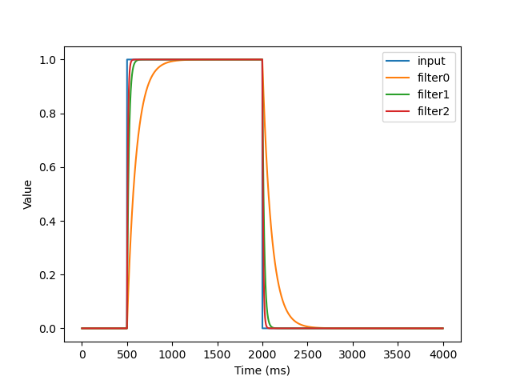

# Exponential smoothing filter

```sh
$ gcc main.c expSmoothing.c -o main
$ ./main
$ python3 plotter.py
```




## Source
[wikipedia](https://en.wikipedia.org/wiki/Exponential_smoothing)

[tttapa.github.io](https://tttapa.github.io/Pages/Mathematics/Systems-and-Control-Theory/Digital-filters/Exponential%20Moving%20Average/Exponential-Moving-Average.html)

[edelkrone Teknik Paylaşımlar](https://www.youtube.com/watch?v=W7joPLxcUPQ)